# Introducción

En el ámbito de la Ciberseguridad, la explotación de aplicaciones web es una actividad clave para comprender las vulnerabilidades más comunes y mejorar la seguridad de los sistemas. Uno de los vectores de ataque más básicos, es el ataque de fuerza bruta, utilizado para adivinar credenciales de acceso mediante la prueba sistemática de combinaciones de nombres de usuario y contraseñas.

En este Write-Up, documentaremos el proceso de explotación de un formulario de login en Damn Vulnerable Web Application (DVWA), una plataforma de prácticas de seguridad diseñada para simular vulnerabilidades reales en un entorno controlado. Exploraremos las distintas configuraciones de seguridad ofrecidas por DVWA (fácil, medio y difícil) y cómo estas afectan la posibilidad de éxito de un ataque de fuerza bruta.

Utilizaremos herramientas ampliamente reconocidas en pruebas de penetración, como Hydra o Potator, para automatizar el ataque, y Burp Suite, para analizar y manipular solicitudes HTTP. Este proceso no solo nos permitirá identificar credenciales de acceso, sino también evaluar la efectividad de las medidas de seguridad implementadas en cada nivel.

El objetivo principal de este Write-Up es proporcionar un análisis práctico y técnico que sea útil tanto para principiantes en ciberseguridad como para profesionales que busquen reforzar sus conocimientos sobre ataques de fuerza bruta y mitigaciones relacionadas.

⚠️ **Nota importante:** Todos los procedimientos descritos en este documento deben realizarse exclusivamente en entornos controlados y con autorización explícita. El uso no autorizado de estas técnicas en sistemas ajenos es ilegal y contrario a la ética profesional.

🎓 **Propósito educativo:** Este Write-Up tiene como único propósito el aprendizaje y la investigación en ciberseguridad. Fomento el uso responsable de estas técnicas y te recuerdo que su aplicación en sistemas reales sin consentimiento es una violación de las leyes y principios éticos. Practicar en entornos seguros como DVWA permite adquirir habilidades esenciales sin comprometer la seguridad de terceros.


## Nivel de seguridad: Bajo

Para realizar este nivel, utilizaremos **Hydra** y **BurpSuite**.

Empezaremos por realizar un intento de inicio de sesión y  capturar la petición con BurpSuite.

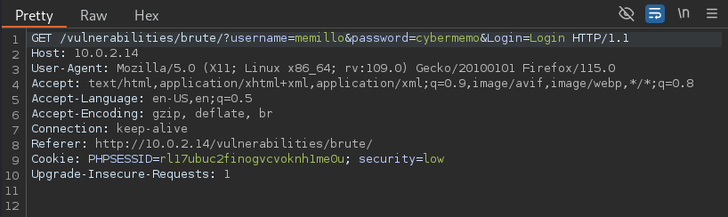

Gracias a este intento de inicio de sesión, ya tenemos el tipo de petición (En la linea 1, se puede ver que es un GET), y tenemos la cabecera necesaria para el siguiente paso.
La cabecera, en este caso empieza y termina en la linea 9. Pero si fuera mas larga empezaría siempre con la palabra Cookie: y terminaría siempre antes de Upgrade-Insecure-Requests: 1.

Con esta información podemos abrir una terminal y empezar a construir nuestro comando con Patator.

⚠️ **Por tema de tiempo y comodidad, los diccionarios serán reducidos para no perder tanto tiempo con la fuerza bruta, también actuaremos como si ya supieramos el primer usuario. El comando no es muy diferente, y me ahorrará mucho tiempo, gracias por entender.** 

>patator http_fuzz url="http://10.0.2.14/vulnerabilities/brute/?username=admin&password=FILE0&Login=Login" method=GET header='Cookie: PHPSESSID=rl17ubuc2finogvcvoknh1me0u; security=low' 0=/usr/share/wordlists/wordlistreducida -x ignore:fgrep='Username and/or password incorrect.'

Ahora procederé a explicar el comando:
1. **patator http_fuzz**: http:fuzz es el módulo de Patator que se usa para realizar fuzzing en las solicitudes HTTP. En este caso, se usa para enviar múltiples solicitudes GET al servidor web con diferentes contraseñas.
2. **url="http://10.0.2.14/vulnerabilities/brute/?username=admin&password=FILE0&Login=Login"**: Con URL= se define la URL del recurso al que se envían las solicitudes. 
   1. El parámetro username está fijo en admin, porque en esta ocasión sabemos el nombre de usuario. Si no lo supiéramos habría que colocar FILE0. 
   2. El parámetro password usa FILE0, que es la variable que indica que el primer diccionario se utilizará para ese parámetro. Si no conociésemos el parámetro username, tendríamos que haber puesto aquí FILE1 para que Potator usara el segundo diccionario. 
   3. Login=Login es otro parametro que se envía en la URL.
3. **method=GET:** Especifica que las solicitudes se harán con el método HTTP GET.
4. **header="Cookie: PHPSESSID=rl17ubuc2finogvcvoknh1me0u; security=low:** Aquí se le indica el header.
5. **0=/usr/share/wordlists/wordlistreducida**: Aquí se le indica que el diccionario para la variable FILE0 será Wordlistreducida. En caso de que tuvieramos otra variable, podríamos seguir indicando diccionarios con 1=/usr... 2=/usr..., etc....
6. **-x ignore:fgrep='Username and/or password incorrect.'**: Define la lógica de exclusion para las respuestas que no interesan. Indica que se ignorarán las respuestas que contengan ese texto.

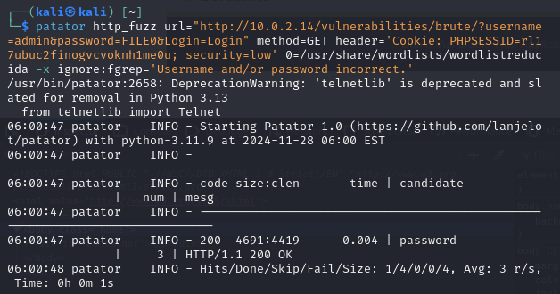

Como vemos el programa se ha detenido en la contraseña "password". Esto nos indica que ha tenido éxito. Vamos a probar la contraseña en la DVWA.

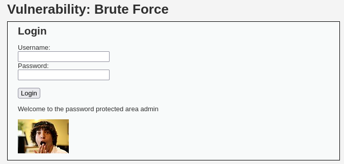

Esto nos indica que la contraseña era correcta. Ahora bien, ¡hay un secreto!
Cuando queremos vulnerar una aplicación web, es vital tener SIEMPRE el inspector de código abierto, e inspeccionar todo lo posible.
Gracias a eso, podemos encontrar cosas como estas.


¡Un directorio con mas usuarios hackeables!
Si vamos a la ruta indicada por ese archivo, nos encontraremos un directorio con los usuarios hackeables.

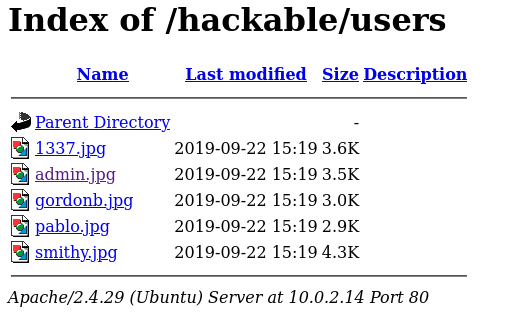

Vamos a vulnerarlos a todos esta vez. Lo haremos con Hydra, para cambiar un poco.

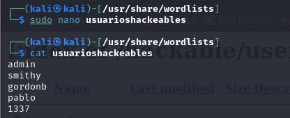

Creamos un diccionario con los usuarios hackeables que hemos encontrado. Y preparamos el comando de Hydra: 

>hydra -L usuarioshackeables -P wordlistreducida 'http-get-form://10.0.2.14/vulnerabilities/brute/:username=\^USER\^&password=\^PASS\^&Login=Login:H=Cookie\:PHPSESSID=rl17ubuc2finogvcvoknh1me0u; security=low:F=Username and/or password incorrect'

Expliquemos el comando:

**hydra**: Es el nombre de la herramienta que estamos utilizando para realizar el ataque de fuerza bruta.

**-L usuarioshackeables**:
- Esta opción indica el archivo que contiene la lista de usuarios que Hydra probará.
- usuarioshackeables es el archivo donde se encuentran los nombres de usuario a probar en el login.

**-P wordlistreducida**:

- Esta opción le dice a Hydra que utilice el archivo de contraseñas wordlistreducida como diccionario de contraseñas.
- Este archivo contiene todas las contraseñas que Hydra intentará junto con los usuarios del archivo anterior.

**'http-get-form://10.0.2.14/vulnerabilities/brute/'**:

- Aquí se define el tipo de solicitud HTTP que se va a hacer, en este caso http-get-form, que significa que la solicitud será un GET.
- http-get-form:// indica que usaremos un formulario GET para enviar las credenciales.
- 10.0.2.14/vulnerabilities/brute/ es la URL del formulario de login en DVWA, donde se realizará el ataque de fuerza bruta.

**username=\^USER\^&password=\^PASS\^&Login=Login**:
- Esta parte de la URL define los parámetros del formulario de login:
- username=\^USER\^: Aquí \^USER\^ es el marcador que Hydra reemplazará por los valores del archivo de usuarios que le proporcionamos.
- password=\^PASS\^: Aquí \^PASS\^ es el marcador que Hydra reemplazará por los valores del archivo de contraseñas que le proporcionamos.
- Login=Login: Este es un valor fijo que corresponde al nombre del botón de envío del formulario (en este caso, el nombre del botón se llama "Login").

**H=Cookie:PHPSESSID=rl17ubuc2finogvcvoknh1me0u; security=low**:

- H se usa para agregar un encabezado HTTP. En este caso, estamos agregando una cookie que es necesaria para la autenticación de la sesión en DVWA.
- PHPSESSID=rl17ubuc2finogvcvoknh1me0u: Es el valor del PHPSESSID que mantiene la sesión activa, necesario para que no se pierda el estado de la sesión mientras se prueban las credenciales.
- security=low: Indica que el nivel de seguridad de DVWA está configurado como bajo (low), lo cual afecta el comportamiento de la aplicación, haciendo que sea más vulnerable a ataques.

**F=Username and/or password incorrect**:
- F se usa para indicar la cadena de texto que se devuelve cuando el login falla. En este caso, es el mensaje de error que DVWA muestra cuando las credenciales son incorrectas.
- Username and/or password incorrect es el mensaje que aparece cuando el usuario o la contraseña son incorrectos. Hydra utiliza este mensaje para saber si un intento ha fallado, y si es así, continuará probando las siguientes combinaciones de usuario y contraseña.

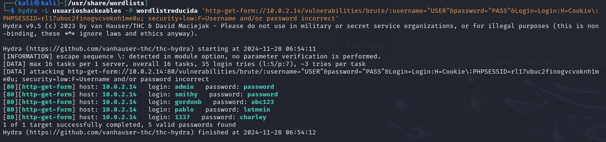

Como podemos comprobar, nos ha encontrado la contraseña de los 5 usuarios hackeables.

## Nivel de seguridad: Medio

La diferencia entre el nivel de seguridad Bajo y el nivel de seguridad Medio, es ínfima, por eso, vamos a proceder con los cambios necesarios y pasar al nivel de seguridad Alto.

Lo único que ha sido añadido para este nivel de seguridad, ha sido un sleep, para realentizar el ataque de fuerza bruta. Lo veremos mas a detalle en el Análisis de las diferencias de seguridad entre los cuatro niveles de seguridad.

Realmente, para ponerlo simple, podemos ejecutar el mismo comando anterior, pues lo unico que va a variar es el tiempo en completarse.

> hydra -L usuarioshackeables -P wordlistreducida 'http-get-form://10.0.2.14/vulnerabilities/brute/:username=\^USER\^&password=\^PASS\^&Login=Login:H=Cookie\:PHPSESSID=rl17ubuc2finogvcvoknh1me0u; security=medium:F=Username and/or password incorrect'

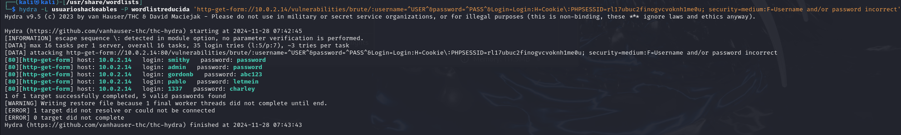

Como veis, es exactamente lo mismo pero tardando mas. A pesar de que al final del comando se ha quejado, realmente se ha completado perfectamente.

## Nivel de seguridad: Alto

El nivel de seguridad Alto ya es otro tema. Vamos a mirar que ha cambiado, antes de ver como podemos atacar.

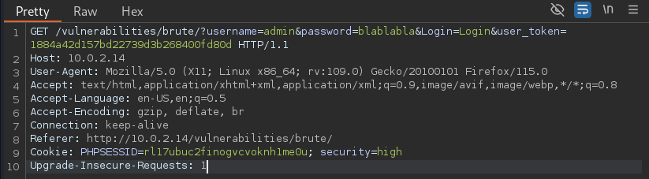

Parece que ahora se genera un token de usuario cada vez que intentamos iniciar sesión...
Resulta que tiene un anti Cross-Site Request Forgery (CSRF) token. Este token se genera cada vez que intentamos iniciar sesión.

Lo que haremos será intentar iniciar sesión con cualquier credencial. Después de esto, la localizamos en el navegador del proxy y la enviamos al intruder.

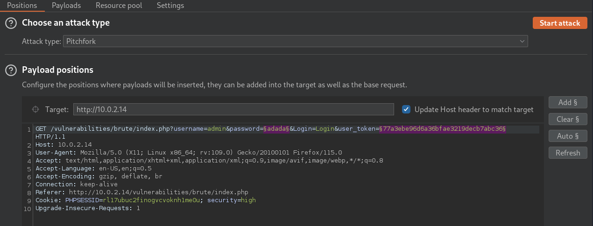

Una vez en el intruder, lo primero de todo seleccionamos el tipo de ataque. Seleccionaremos Pitchfork, para poder utilizar dos payloads.

Después, seleccionaremos la contraseña y le daremos a "Add" y haremos lo mismo con el user_token.

Después de eso, nos iremos a Payloads.

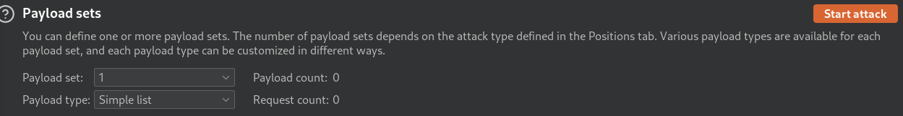

En Payload sets, lo dejaremos así, Simple list, para poder subir la lista de contraseñas. Y payload set en 1.

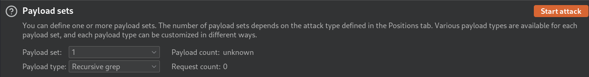

Despues de eso, en Payload set, seleccionaremos 2, y en Payload type, seleccionaremos Recursive Grep.

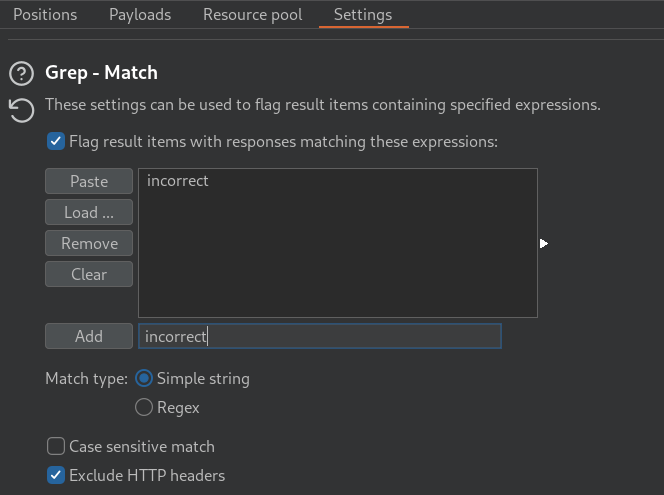

En Settings debemos de ir a Grep - Match y añadir incorrect.

Justo debajo de Grep - Match, tenemos Grep - Extract. Tenemos que buscar el token y seleccionarlo. Despues de esto, debemos de marcar las opciones Start at offset y End at fixed length.

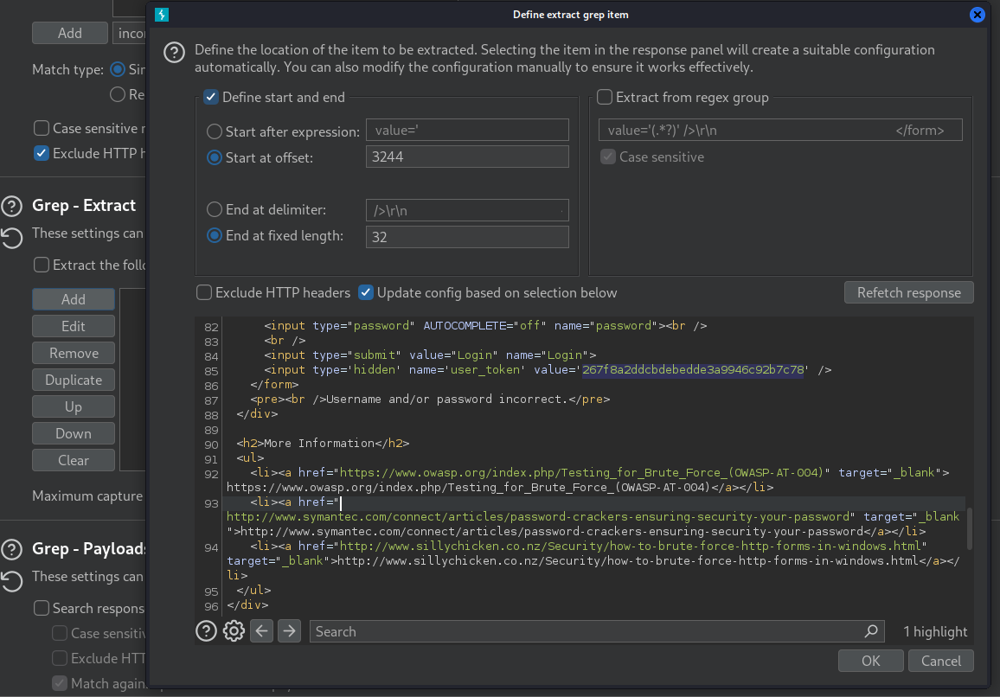

Mas abajo encontraremos la sección de Redirections
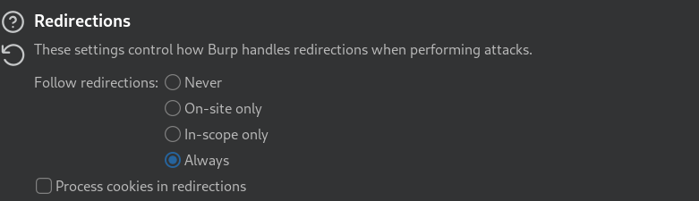
Debemos de marcar Always. Siempre queremos seguir las redirecciones.


Lanzamos el ataque y esperamos.

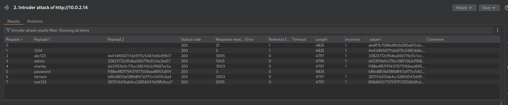

Como podemos ver, la única contraseña que no tiene incorrect es "password". La contraseña de Admin. Con esto, hemos conseguido hacerle fuerza bruta al nivel de seguridad ALTO.


# Análisis de las diferencias de seguridad entre los cuatro niveles de seguridad


## Resumen del analisis comparativo

1. Nivel bajo:
   1. No hay medidas específicas contra fuerza bruta.
   2. Riesgo: Vulnerable a ataques de fuerza bruta sin restricciones.

2. Nivel medio:
   1. Introduce un retraso fijo (2 segundos) tras fallos
   2. Riesgo: Disuade parcialmente ataques rápidos, pero sigue vulnerable a ataques distribuidos o persistentes.

3. Nivel alto:
   1. Mejora el retraso, haciéndolo aleatorio (0-3 segundos), y usa mensajes genéricos.
   2. Riesgo: Dificulta ataques automatizados, pero carece de límites de intentos fallidos y bloqueo de cuentas.

4. Nivel imposible:
   1. Incluye un límite de intentos fallidos, bloqueo temporal, retrasos aleatorios más largos (2-4 segundos) y registro en la base de datos.
   2. Riesgo: Resistente a ataques individuales, pero aún vulnerable a ataques distribuidos y carece de CAPTCHA.

Ahora pasaré a desarrollar mas los niveles de seguridad y sus diferencias.

| Medida                                 | Nivel de seguridad: Bajo           | Nivel de seguridad: Medio | Nivel de seguridad: Alto | Nivel de seguridad: Imposible |
| :------------------------------------- | :--------------------------------- | ------------------------: | -----------------------: | ----------------------------: |
| Límite de intentos fallidos            | ❌                                  |                         ❌ |                        ❌ |                             ✅ |
| Bloqueo temporal de la cuenta          | ❌                                  |                         ❌ |                        ❌ |                ✅ (15 minutos) |
| Retrasos en respuestas                 | ❌                                  |           ✅ (fijo: 2 seg) |   ✅ (aleatorio: 0-3 seg) |        ✅ (aleatorio: 2-4 seg) |
| Mensajes genéricos                     | ❌ (Usuario/contraseña incorrectos) |                         ❌ |            ✅ (genéricos) |      ✅ (genéricos y extensos) |
| Protección contra ataques distribuidos | ❌                                  |                         ❌ |                        ❌ |                             ❌ |
| Uso de CAPTCHA                         | ❌                                  |                         ❌ |                        ❌ |                             ❌ |
| Registro de intentos fallidos          | ❌                                  |                         ❌ |                        ❌ |          ✅ (en base de datos) |
| Notificaciones al usuario              | ❌                                  |                         ❌ |                        ❌ |        ✅ (tras login exitoso) |
| Restablecimiento tras login exitoso    | ❌                                  |                         ❌ |                        ❌ |                             ✅ |


### Nivel bajo de seguridad

```PHP

<?php

if( isset( $_GET[ 'Login' ] ) ) {
    // Get username
    $user = $_GET[ 'username' ];

    // Get password
    $pass = $_GET[ 'password' ];
    $pass = md5( $pass );

    // Check the database
    $query  = "SELECT * FROM `users` WHERE user = '$user' AND password = '$pass';";
    $result = mysqli_query($GLOBALS["___mysqli_ston"],  $query ) or die( '<pre>' . ((is_object($GLOBALS["___mysqli_ston"])) ? mysqli_error($GLOBALS["___mysqli_ston"]) : (($___mysqli_res = mysqli_connect_error()) ? $___mysqli_res : false)) . '</pre>' );

    if( $result && mysqli_num_rows( $result ) == 1 ) {
        // Get users details
        $row    = mysqli_fetch_assoc( $result );
        $avatar = $row["avatar"];

        // Login successful
        echo "<p>Welcome to the password protected area {$user}</p>";
        echo "";
    }
    else {
        // Login failed
        echo "<pre><br />Username and/or password incorrect.</pre>";
    }

    ((is_null($___mysqli_res = mysqli_close($GLOBALS["___mysqli_ston"]))) ? false : $___mysqli_res);
}

?> 

``` 

Como podemos ver, no hay ni una sola medida de seguridad.

- No hay limitación de intentos de login
- No hay bloqueo de IP ni de Usuario
- No hay tiempos de espera entre intentos
- Los mensajes de error son genéricos y consistentes.

Las medidas que yo recomendaría para mitigar los ataques de fuerza bruta, serían:

- Poner un límite de intentos de login.
- Bloqueo temporal de la IP y del Usuario.
- Que cada vez haya un retraso mas largo entre intentos fallidos.
- Añadir un CAPTCHA después de algunos intentos fallidos, para evitar bots.
- Añadir alertas administrativas para alertar al administrador en caso de detectar muchos intentos fallidos de un usuario específico.


### Nivel medio de seguridad

```PHP
<?php

if( isset( $_GET[ 'Login' ] ) ) {
    // Sanitise username input
    $user = $_GET[ 'username' ];
    $user = ((isset($GLOBALS["___mysqli_ston"]) && is_object($GLOBALS["___mysqli_ston"])) ? mysqli_real_escape_string($GLOBALS["___mysqli_ston"],  $user ) : ((trigger_error("[MySQLConverterToo] Fix the mysql_escape_string() call! This code does not work.", E_USER_ERROR)) ? "" : ""));

    // Sanitise password input
    $pass = $_GET[ 'password' ];
    $pass = ((isset($GLOBALS["___mysqli_ston"]) && is_object($GLOBALS["___mysqli_ston"])) ? mysqli_real_escape_string($GLOBALS["___mysqli_ston"],  $pass ) : ((trigger_error("[MySQLConverterToo] Fix the mysql_escape_string() call! This code does not work.", E_USER_ERROR)) ? "" : ""));
    $pass = md5( $pass );

    // Check the database
    $query  = "SELECT * FROM `users` WHERE user = '$user' AND password = '$pass';";
    $result = mysqli_query($GLOBALS["___mysqli_ston"],  $query ) or die( '<pre>' . ((is_object($GLOBALS["___mysqli_ston"])) ? mysqli_error($GLOBALS["___mysqli_ston"]) : (($___mysqli_res = mysqli_connect_error()) ? $___mysqli_res : false)) . '</pre>' );

    if( $result && mysqli_num_rows( $result ) == 1 ) {
        // Get users details
        $row    = mysqli_fetch_assoc( $result );
        $avatar = $row["avatar"];

        // Login successful
        echo "<p>Welcome to the password protected area {$user}</p>";
        echo "";
    }
    else {
        // Login failed
        sleep( 2 );
        echo "<pre><br />Username and/or password incorrect.</pre>";
    }

    ((is_null($___mysqli_res = mysqli_close($GLOBALS["___mysqli_ston"]))) ? false : $___mysqli_res);
}

?> 
```

Como se puede ver, el único cambio relevante respecto al nivel de seguridad Bajo, es el sleep( 2 );.
Es cierto que este retraso dificulta los intentos a corto plazo, pero, no sirve para nada. Este retraso como mínimo, debería de ser acumulativo.

Los problemas y las medidas a tomar serían las mismas que se han mencionado en el nivel bajo de seguridad, exceptuando el tiempo de espera.

- No hay limitación de intentos de login
- No hay bloqueo de IP ni de Usuario
- Los mensajes de error son genéricos y consistentes.

Las medidas que yo recomendaría para mitigar los ataques de fuerza bruta, serían:

- Poner un límite de intentos de login.
- Bloqueo temporal de la IP y del Usuario.
- Que cada vez haya un retraso mas largo entre intentos fallidos.
- Añadir un CAPTCHA después de algunos intentos fallidos, para evitar bots.
- Añadir alertas administrativas para alertar al administrador en caso de detectar muchos intentos fallidos de un usuario específico.

### Nivel alto de seguridad
```PHP
<?php

if( isset( $_GET[ 'Login' ] ) ) {
    // Check Anti-CSRF token
    checkToken( $_REQUEST[ 'user_token' ], $_SESSION[ 'session_token' ], 'index.php' );

    // Sanitise username input
    $user = $_GET[ 'username' ];
    $user = stripslashes( $user );
    $user = ((isset($GLOBALS["___mysqli_ston"]) && is_object($GLOBALS["___mysqli_ston"])) ? mysqli_real_escape_string($GLOBALS["___mysqli_ston"],  $user ) : ((trigger_error("[MySQLConverterToo] Fix the mysql_escape_string() call! This code does not work.", E_USER_ERROR)) ? "" : ""));

    // Sanitise password input
    $pass = $_GET[ 'password' ];
    $pass = stripslashes( $pass );
    $pass = ((isset($GLOBALS["___mysqli_ston"]) && is_object($GLOBALS["___mysqli_ston"])) ? mysqli_real_escape_string($GLOBALS["___mysqli_ston"],  $pass ) : ((trigger_error("[MySQLConverterToo] Fix the mysql_escape_string() call! This code does not work.", E_USER_ERROR)) ? "" : ""));
    $pass = md5( $pass );

    // Check database
    $query  = "SELECT * FROM `users` WHERE user = '$user' AND password = '$pass';";
    $result = mysqli_query($GLOBALS["___mysqli_ston"],  $query ) or die( '<pre>' . ((is_object($GLOBALS["___mysqli_ston"])) ? mysqli_error($GLOBALS["___mysqli_ston"]) : (($___mysqli_res = mysqli_connect_error()) ? $___mysqli_res : false)) . '</pre>' );

    if( $result && mysqli_num_rows( $result ) == 1 ) {
        // Get users details
        $row    = mysqli_fetch_assoc( $result );
        $avatar = $row["avatar"];

        // Login successful
        echo "<p>Welcome to the password protected area {$user}</p>";
        echo "";
    }
    else {
        // Login failed
        sleep( rand( 0, 3 ) );
        echo "<pre><br />Username and/or password incorrect.</pre>";
    }

    ((is_null($___mysqli_res = mysqli_close($GLOBALS["___mysqli_ston"]))) ? false : $___mysqli_res);
}

// Generate Anti-CSRF token
generateSessionToken();

?> 
```

Tenemos nuevas medidas que complican bastante las cosas.
1. Se ha añadido un tiempo de espera aleatorio de entre 0 y 3 segundos despues de un intento fallido. Aun siendo un buen avance, yo preferiría que fuera un aumento acumulativo. 
2. Se ha añadido tamibén un token Anti-CSRF. Este token está diseñado para prevenir ataques CSRF (https://owasp.org/www-community/attacks/csrf) pero tambien ayuda a dificultar la automatización dei ntentos masivos.

Persisten las vulnerabilidades anteriores como:
- Aun no tiene limite de intentos fallidos.
- Sigue sin bloquear el IP ni el Usuario.
- Aun no tiene aumento progresivo de los tiempos de espera.
- Los mensajes de error siguen siendo consistentes.

Las recomendaciones, seguirían siendo las mismas.

- Poner un límite de intentos de login.
- Bloqueo temporal de la IP y del Usuario.
- Que cada vez haya un retraso mas largo entre intentos fallidos.
- Añadir un CAPTCHA después de algunos intentos fallidos, para evitar bots.
- Añadir alertas administrativas para alertar al administrador en caso de detectar muchos intentos fallidos de un usuario específico.

### Nivel de seguridad IMPOSIBLE

```PHP
<?php

if( isset( $_POST[ 'Login' ] ) && isset ($_POST['username']) && isset ($_POST['password']) ) {
    // Check Anti-CSRF token
    checkToken( $_REQUEST[ 'user_token' ], $_SESSION[ 'session_token' ], 'index.php' );

    // Sanitise username input
    $user = $_POST[ 'username' ];
    $user = stripslashes( $user );
    $user = ((isset($GLOBALS["___mysqli_ston"]) && is_object($GLOBALS["___mysqli_ston"])) ? mysqli_real_escape_string($GLOBALS["___mysqli_ston"],  $user ) : ((trigger_error("[MySQLConverterToo] Fix the mysql_escape_string() call! This code does not work.", E_USER_ERROR)) ? "" : ""));

    // Sanitise password input
    $pass = $_POST[ 'password' ];
    $pass = stripslashes( $pass );
    $pass = ((isset($GLOBALS["___mysqli_ston"]) && is_object($GLOBALS["___mysqli_ston"])) ? mysqli_real_escape_string($GLOBALS["___mysqli_ston"],  $pass ) : ((trigger_error("[MySQLConverterToo] Fix the mysql_escape_string() call! This code does not work.", E_USER_ERROR)) ? "" : ""));
    $pass = md5( $pass );

    // Default values
    $total_failed_login = 3;
    $lockout_time       = 15;
    $account_locked     = false;

    // Check the database (Check user information)
    $data = $db->prepare( 'SELECT failed_login, last_login FROM users WHERE user = (:user) LIMIT 1;' );
    $data->bindParam( ':user', $user, PDO::PARAM_STR );
    $data->execute();
    $row = $data->fetch();

    // Check to see if the user has been locked out.
    if( ( $data->rowCount() == 1 ) && ( $row[ 'failed_login' ] >= $total_failed_login ) )  {
        // User locked out.  Note, using this method would allow for user enumeration!
        //echo "<pre><br />This account has been locked due to too many incorrect logins.</pre>";

        // Calculate when the user would be allowed to login again
        $last_login = strtotime( $row[ 'last_login' ] );
        $timeout    = $last_login + ($lockout_time * 60);
        $timenow    = time();

        /*
        print "The last login was: " . date ("h:i:s", $last_login) . "<br />";
        print "The timenow is: " . date ("h:i:s", $timenow) . "<br />";
        print "The timeout is: " . date ("h:i:s", $timeout) . "<br />";
        */

        // Check to see if enough time has passed, if it hasn't locked the account
        if( $timenow < $timeout ) {
            $account_locked = true;
            // print "The account is locked<br />";
        }
    }

    // Check the database (if username matches the password)
    $data = $db->prepare( 'SELECT * FROM users WHERE user = (:user) AND password = (:password) LIMIT 1;' );
    $data->bindParam( ':user', $user, PDO::PARAM_STR);
    $data->bindParam( ':password', $pass, PDO::PARAM_STR );
    $data->execute();
    $row = $data->fetch();

    // If its a valid login...
    if( ( $data->rowCount() == 1 ) && ( $account_locked == false ) ) {
        // Get users details
        $avatar       = $row[ 'avatar' ];
        $failed_login = $row[ 'failed_login' ];
        $last_login   = $row[ 'last_login' ];

        // Login successful
        echo "<p>Welcome to the password protected area <em>{$user}</em></p>";
        echo "";

        // Had the account been locked out since last login?
        if( $failed_login >= $total_failed_login ) {
            echo "<p><em>Warning</em>: Someone might of been brute forcing your account.</p>";
            echo "<p>Number of login attempts: <em>{$failed_login}</em>.<br />Last login attempt was at: <em>${last_login}</em>.</p>";
        }

        // Reset bad login count
        $data = $db->prepare( 'UPDATE users SET failed_login = "0" WHERE user = (:user) LIMIT 1;' );
        $data->bindParam( ':user', $user, PDO::PARAM_STR );
        $data->execute();
    } else {
        // Login failed
        sleep( rand( 2, 4 ) );

        // Give the user some feedback
        echo "<pre><br />Username and/or password incorrect.<br /><br/>Alternative, the account has been locked because of too many failed logins.<br />If this is the case, <em>please try again in {$lockout_time} minutes</em>.</pre>";

        // Update bad login count
        $data = $db->prepare( 'UPDATE users SET failed_login = (failed_login + 1) WHERE user = (:user) LIMIT 1;' );
        $data->bindParam( ':user', $user, PDO::PARAM_STR );
        $data->execute();
    }

    // Set the last login time
    $data = $db->prepare( 'UPDATE users SET last_login = now() WHERE user = (:user) LIMIT 1;' );
    $data->bindParam( ':user', $user, PDO::PARAM_STR );
    $data->execute();
}

// Generate Anti-CSRF token
generateSessionToken();

?> 
```

Ahora sí, mejoras muy significativas.
  1. Han añadido por fin un limite de intentos fallidos. Si a la tercera no has conseguido loguearte, se bloquea la cuenta temporalmente (15 minutos).
  2. Hay un retraso aleatorio en las respuestas algo mas largo.
  3. El mensaje de error ahora es diferente, impidiendo la enumeración de usuarios.
  4. Si una cuenta bloqueada se usa con exito, se alertará al usuario sobre que ha tenido intentos previos fallidos.


Para este nivel, me hubiera esperado alguna protección contra ataques distribuidos. El código no analiza patrones de multiples intentos desde diferentes IP hacia la misma cuenta.

La notificación debería de ser proactiva, notificar al usuario despues de que su cuenta sea bloqueada, y que este se entere, no al iniciar sesion, si no cuando le atacan.

# Conclusión

Después de analizar los cuatro niveles de seguridad contra fuerza bruta en DVWA, queda claro cómo evoluciona la seguridad a medida que se implementan medidas más avanzadas. Este análisis me ha servido no solo para entender cómo funcionan estas protecciones, sino también para identificar las carencias de cada nivel, algo clave en mi formación como especialista en Blue Team. Es importante destacar que incluso el nivel más alto ("Imposible") no es perfecto y deja margen de mejora.

El nivel bajo es un desastre en cuanto a seguridad. No hay ningún tipo de medida contra fuerza bruta, permitiendo intentos ilimitados de inicio de sesión. Esto hace que un atacante pueda probar tantas contraseñas como quiera sin restricciones. Aunque es útil para aprender, este enfoque es inviable en cualquier entorno real, ya que no ofrece ninguna protección.

En el nivel medio, se da un paso adelante al introducir un retraso fijo de 2 segundos tras cada intento fallido. Esto dificulta ligeramente los ataques automatizados al ralentizar los intentos, pero sigue siendo insuficiente. No hay un límite de intentos fallidos ni bloqueo de cuentas, lo que lo deja expuesto a ataques persistentes. Además, los mensajes de error son demasiado específicos, lo que da pistas al atacante sobre la validez de las credenciales, facilitando la enumeración de usuarios.

El nivel alto mejora al introducir retrasos aleatorios de entre 0 y 3 segundos, haciendo que los ataques automatizados sean menos efectivos. También se generalizan los mensajes de error, evitando que un atacante pueda deducir si el usuario existe o no. Sin embargo, sigue sin haber límites en los intentos fallidos ni bloqueos temporales, lo que deja el sistema vulnerable a ataques más sofisticados o distribuidos. Aunque es más seguro que los niveles anteriores, todavía es insuficiente para un entorno real.

El nivel imposible implementa varias mejoras importantes. Establece un límite de 3 intentos fallidos antes de bloquear la cuenta durante 15 minutos. Además, registra los intentos fallidos y el último inicio de sesión en la base de datos, lo que permite un monitoreo más detallado. Incluso notifica al usuario si alguien ha intentado acceder a su cuenta, lo que añade una capa extra de transparencia. Sin embargo, aunque es el nivel más seguro, aún tiene debilidades: no utiliza CAPTCHA para prevenir ataques distribuidos ni bloquea direcciones IP sospechosas. Tampoco se emplean técnicas avanzadas como el análisis de comportamiento para detectar patrones anómalos.

Este análisis me demuestra cómo las medidas contra fuerza bruta no se implementan de forma aislada, sino como parte de un enfoque integral. El nivel "Imposible" es una buena base, pero en un sistema real implementaría mejoras adicionales, como CAPTCHA, autenticación multifactor, listas negras de IPs maliciosas y herramientas de monitoreo en tiempo real. Esta experiencia me ayuda a entender no solo cómo proteger un sistema, sino también cómo evaluar y mejorar sus puntos débiles para prevenir ataques en entornos reales.