# Introducción

En esta ocasión, traigo un ejercicio práctico, para que podamos explorar juntos un enfoque metodológico para identificar vulnerabilidades y comprometer un sistema.

En esta ocasión, usaremos herramientas las siguientes herramientas: NMAP, CEWL, Burp Suite y pspy64, los cuales serán comentadas un poco mas en profundidad cuando lleguemos a ellas.

Este tipo de análisis es importante para entender como es que los atacantes pueden explotar sistemas mal configurado.

<!-- markdownlint-capture -->
<!-- markdownlint-disable -->

> **Nota importante:** Todos los procedimientos descritos en este documento deben realizarse exclusivamente en entornos controlados y con autorización explícita. El uso no autorizado de estas técnicas en sistemas ajenos es ilegal y contrario a la ética profesional.
{: .prompt-warning }

> **Propósito educativo:** Este Write-Up tiene como único propósito el aprendizaje y la investigación en Ciberseguridad. Fomento el uso totalmente responsable de estas técnicas y te recuerdo que su aplicación en sistemas reales sin consentimiento es una violación de las leyes y principios éticos. Practicar en entornos seguros permite adquirir habilidades esenciales sin comprometer la seguridad de terceros.
{: .prompt-info }

<!-- markdownlint-restore -->

# Desarrollo

## Reconocimiento web
El primer paso, consistió en escanear la red para identificar las direcciones IP y los puertos abiertos.

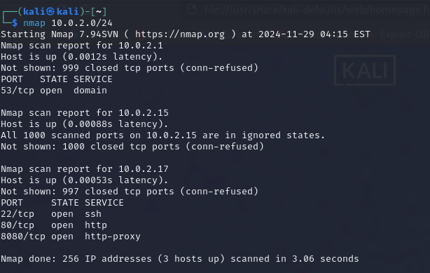

<!-- markdownlint-capture -->
<!-- markdownlint-disable -->

> Nmap es una herramienta utilizada para explorar redes y descubrir dispositivos conectados a ellas. Es comúnmente usada para comprobar la seguridad de redes y encontrar posibles vulnerabilidades.
{: .prompt-tip }

<!-- markdownlint-restore -->
En esta ocasión, nuestro NMAP ha sido muy básico, puesto que lo único que queríamos en esta ocasión, es escanear nuestra red para saber que dispositivos están conectados a esta.

Encontramos que la máquina objetivo, tiene los puertos 22 (SSH), 80 (HTTP), y 8080 (HTTPS) abiertos.

## Análisis del entorno web

Accediendo al servicio HTTP, descubrimos que el sitio web utilizaba el CMS[^footnote] Sitemagic.

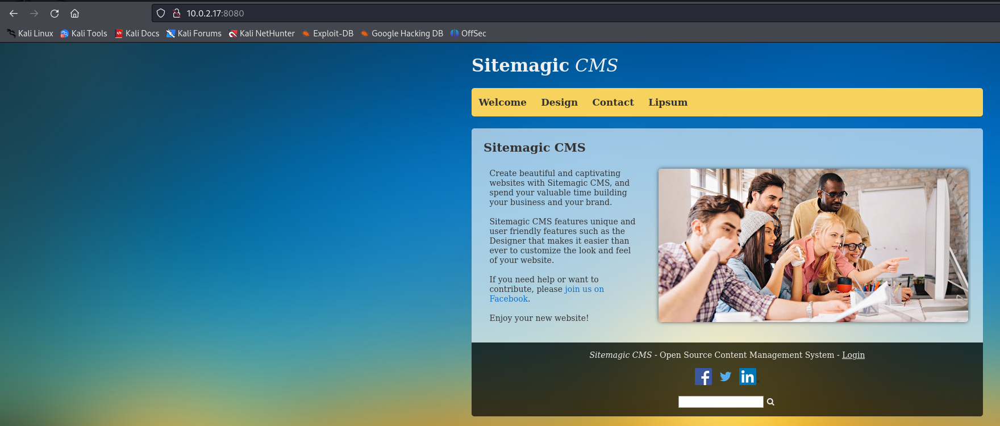

Investigando el CMS, podemos localizar rápidamente el panel de Inicio de Sesión.

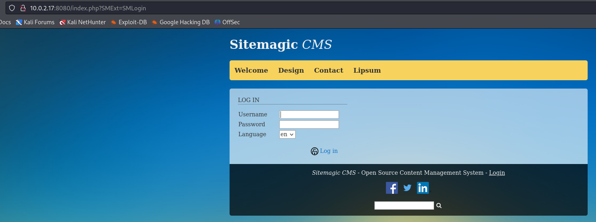

La aplicación web no parece para nada segura, así que, de primeras, vamos a intentar hacer una fuerza bruta.
(El nombre del CTF también ayuda :P)

## Generación del diccionario personalizado con Cewl

CEWL es una herramienta que genera diccionarios personalizados a partir de palabras encontradas en páginas web. Se utiliza principalmente en pruebas de fuerza bruta para obtener contraseñas.

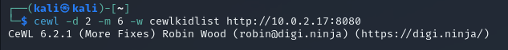

Voy a proceder a explicar el comando utilizado:
- cewl: invoca a la herramienta CEWL.
- -d 2: Establece la profundidad de enlaces. Quiere decir que, seguirá los enlaces hasta 2 niveles dentro de la estructura de la aplicación web.
- -m 6: Indica la longitud mínima de las palabras que se incluirán en el diccionario. En este caso, 6.
- -w cewlkidlist: Indica el archivo de salida donde se guardará el diccionario generado.
- http://10.0.2.17:8080: Especifíca la URL del sitio que CEWL analizará para extraer las palabras.

## Explotación del sistema

Ahora que ya tenemos el diccionario personalizado, vamos a iniciar la fuerza bruta. Para aumentar la eficacia, primero vamos a intentarlo con el usuario por defecto. 
Una búsqueda de Google mas tarde, entrando al primer resultado, llegamos al siguiente sitio.

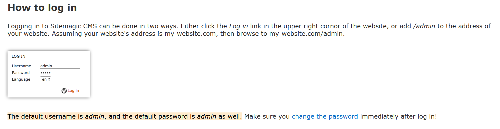

Podemos observar en lo subrayado, que el usuario por defecto es admin.

Ahora pues, vamos a abrir el Burpsuite para ejecutar el ataque de fuerza brutal.

<!-- markdownlint-capture -->
<!-- markdownlint-disable -->

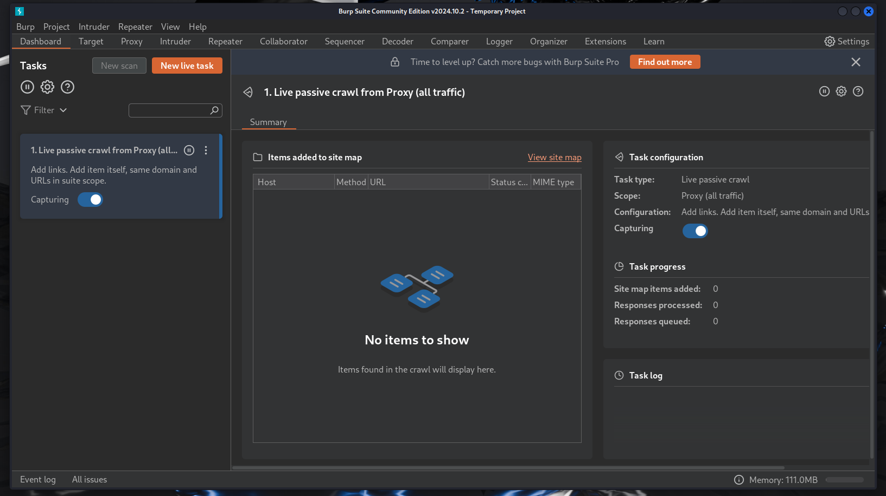

> Burp Suite es una herramienta usada para pruebas de seguridad web, que permite interceptar, analizar y modificar tráfico HTTP/S para encontrar vulnerabilidades.
{: .prompt-tip }

<!-- markdownlint-restore -->

Habiendo activado el proxy[^fn-nth-2] en nuestro navegador, procedemos a intentar un inicio de sesión, para capturar la información de este.

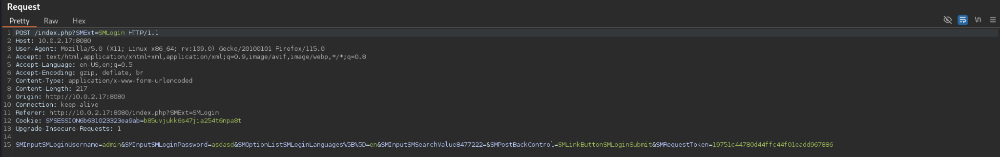

Envíamos la petición al intruder, y procedemos a configurar el ataque.
1. El payload[^fn-nth-3] debe ser un Simple List[^fn-nth-4], y procederemos a cargar el diccionario que hemos generado con CEWL.
2. El tipo de ataque será Sniper attack[^fn-nth-5].
3. En la configuración, debemos de añadir la palabra clave, que usará el programa para saber que la contraseña no es correcta. Esto se hace en Grep - Match, en este caso añadiremos la palabra Incorrect.
4. También en configuración debemos de activar la redirección y dejarla en Always.

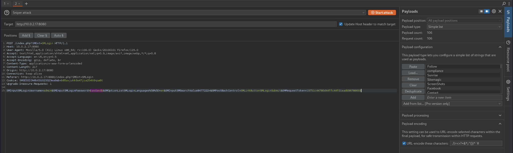

Así debería de quedarnos configurado el ataque, recordemos que hay que añadir el símbolo del payload entre la contraseña, para que el payload sea ejecutado en esa variable.

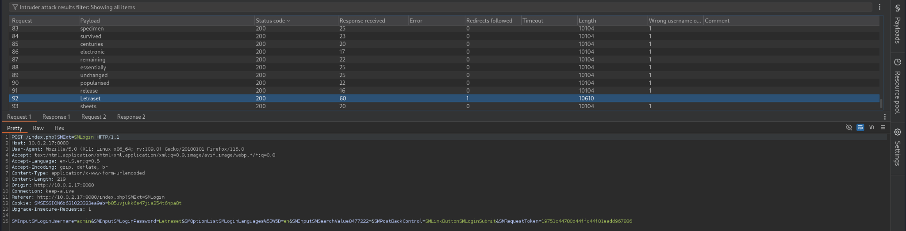

Como podemos ver, la única contraseña que no tiene el valor en el campo de "Wrong username or password" es Letraset, la cual resulta ser, la contraseña del usuario Admin. 

Una vez iniciamos sesión con el usuario y la contraseña, nos dirigimos a la sección de subida de archivos y subimos la reverse shell[^fn-nth-6] al servidor web.

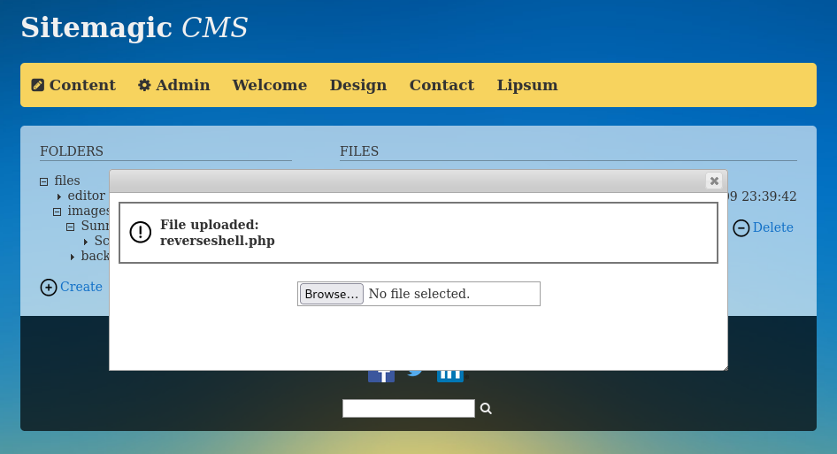

Después de la haber subido la reverse shell, iniciamos la escucha con NC[^fn-nth-7], con el comando siguiente comando:

> nc -lvnp 9001

- -l: Hace que netcat escuche por conexiones entrantes.
- -v: Muestra información detallada sobre el proceso de conexión.
- -n: Indica que Netcat no debe intentar hacer resolución DNS.
- -p: Especifica el puerto en el que Netcat debe escuchar
- 9001: El puerto

Y después de esto, ejecutamos la shell yendo a la ruta donde se subió esta. En este caso, la ruta es _10.0.2.17:8080/files/images/reverseshell.php_

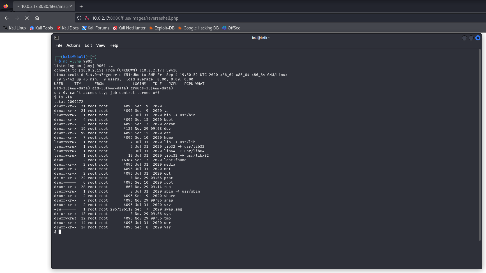

Después de esto, ya hemos conseguido la conexión con la máquina, y ahora solo queda la...

## Escalada de privilegios con Pspy

Pspy es una herramienta para monitorear y registrar procesos en sistemas Linux. Permite observar qué procesos están siendo ejecutados, qué usuarios los están ejecutando y qué comandos están siendo lanzados, todo sin necesidad de privilegios de root. Es útil para detectar actividad sospechosa en un sistema comprometido, ya que permite ver qué está ocurriendo en segundo plano sin modificar el sistema. Pero, en esta ocasión, será util precisamente por no necesitar privilegios de root para observar los procesos.

Procedemos a descargarnos PSPY64(la versión de 64bits) con WGET[^fn-nth-8].

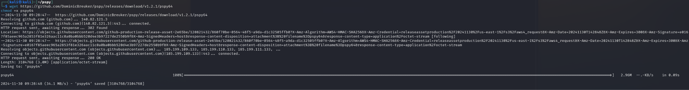

Una vez descargado el PSPY64, tenemos que abrirnos una terminal nueva y ejecutar un servidor HTTP con Python, con siguiente comando:
> python3 -m http.server 8000

- python3: Ejecuta Python 3.
- -m http.server: Inicia el módulo http.server, que crea un servidor web básico para servir archivos desde el directorio actual.
- 8000: Especifica el puerto en el que el servidor escuchará (en este caso, el puerto 8000).

En la máquina victima, hacemos un WGET a nuestra máquina hacia la ruta en la que está pspy64.

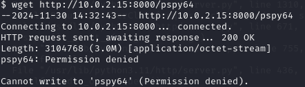

Como se puede ver, no tenemos permisos para descargar nada en este directorio. Así que tenemos que movernos a uno donde lo tengamos. Procedo a moverme a TMP, puesto que generalmente, todos los usuarios tienen permiso de escritura ahí.

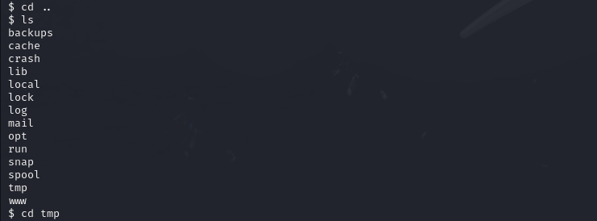

Volvemos a hacer el WGET, esta vez como se puede observar, si tenemos permisos y se descarga perfectamente.

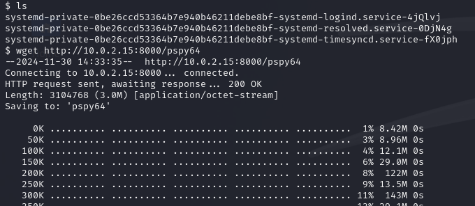

Procedemos a ejecutar PSPY y esperamos. Nada mas ejecutarlo, tarda un poco puesto que se queda observando que procesos están siendo ejecutados.

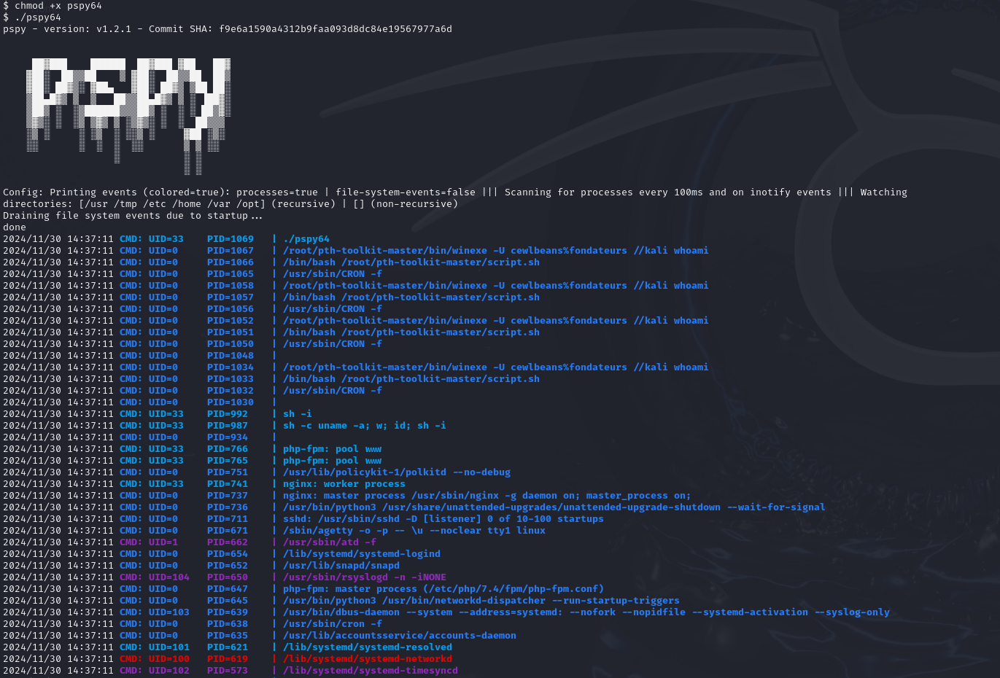

Si nos fijamos en los procesos, podemos ver uno que se está ejecutando desde root. El -U nos indica que esos dos parámetros que aparecen, cewlbeans%fundateurs, son el usuario y la contraseña que buscamos.

Con SSH[^fn-nth-9], iniciamos sesión con el usuario y contraseña.

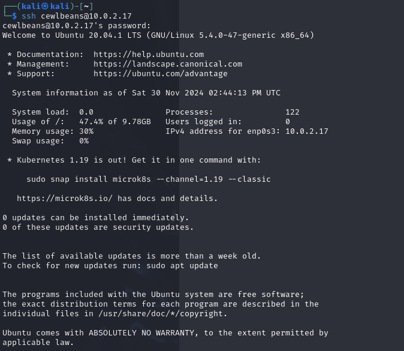

Cambiamos al usuario Root con el comando SU (Switch User)

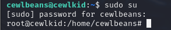

Al cambiar a Root, tenemos total control del equipo. Ahora, a buscar esa Flag. Nos movemos a la carpeta de root, y hacemos un list (ls). Vemos que hay un root.txt... ¿que será?

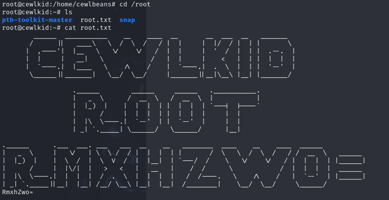

## Conclusiones

### Análisis de los problemas de seguridad en la máquina Cewlkid

La máquina presenta una serie de problemas de seguridad que, voy a proceder a analizar y aprender de ellas.

1. Servicios expuestos innecesariamente
   1. La máquina expone servicios clave como SSH, HTTP y HTTPS. Habría que restringir el acceso a los servicios mediante firewalls o listas de control de acceso.
2. Uso de credenciales por defecto
   1. El usuario por defecto y la ausencia de medidas para proteger estas cuentas, han dejado al sistema vulnerable a ataques de fuerza bruta. Deberían de eliminarse las credenciales predeterminadas, implementar contraseñas fuertes y aplicar un sistema de bloqueo tras varios intentos fallidos de inicio de sesión.
3. Vulnerabilidad en el CMS Sitemagic.
   1. El CMS utilizado no presentó suficientes medidas de seguridad para prevenir los ataques de fuerza bruta ni la subida de archivos maliciosos. No hubo validación en la sección de subida de archivos, permitiendo subir una reverse shell sin ninguna complicación. La solución radica en restringir los tipos de archivos y verificar las extensiones. También, en almacenar los archivos subidos en directorios no ejecutables.
4. Falta de monitorización de procesos
   1. La máquina no tiene un sistema de detección de intrusiones, que podría haber detectado en tiempo real la ejecución de pspy64. Debería de implementarse algún IDS como Auditd o Sysmon.
5. Exposición de información sensible
   1. El proceso detectado con pspy64 expone credenciales sensibles. La mala gestión de secretos y credenciales es un problema muy grave, habría que usar gestores de secretos seguros como HashiCorp Vault.

### ¿Por qué usar herramientas como CEWL, en vez de un diccionario como rockyou.txt, por ejemplo?

Usar herramientas como CEWL en lugar de un diccionario como rockyou.txt, tiene ventajas dependiendo del contexto del ataque.
1. CEWL genera un diccionario basado en el contenido del sitio objetivo. Puede ser util al incluir palabras relevantes para esa página web, como nombres, tecnicismos y/o palabras clave que podrían ser utilizadas como contraseñas.
2. Evita datos innecesarios, puesto que rockyou.txt contiene millones de contraseñas genéricas y ralentizaría demasiado los ataques.

### ¿Rockyou.txt, es útil?
Sí, es útil cuando no se tiene información específica del objetivo y se busca probar con contraseñas comunes. Es ideal para ataques de fuerza bruta masivos.

### Reflexión sobre la máquina

Las vulnerabilidades de esta máquina me parecen representativas de errores comunes que se pueden encontrar en sistemas mal configurados.

Por eso me parece totalmente necesario diseñar los sistemas seguros desde el inicio utilizando los principios del mínimo privilegio, a parte de la actualización y el parcheo de todos los sistemas para que no queden expuestos, incluyendo la CMS.

### Reflexión general

El ejercicio de comprometer y analizar una máquina como Cewlkid no solo representa una oportunidad técnica, sino también un momento para reflexionar sobre la responsabilidad y la ética en la Ciberseguridad...

 Practicar en entornos controlados permite aprender de manera segura y ética, alejándonos de prácticas que puedan causar daño. Este tipo de experiencias destaca la importancia de entender cómo operan los atacantes para proteger de manera efectiva los sistemas reales.

Cada máquina nos reta a salir de nuestra zona de confort y a explorar nuevas herramientas y técnicas, lo que subraya la naturaleza dinámica y en constante evolución del campo de la Ciberseguridad. Aprender a abordar problemas desde múltiples perspectivas, como atacante y defensor, nos permite convertirnos en profesionales más completos y capaces de enfrentar desafíos complejos.

Finalmente, este tipo de actividades reafirman el valor del aprendizaje continuo. Cada herramienta, cada técnica, y cada error cometido son pasos hacia el dominio de habilidades críticas. La verdadera fortaleza en Ciberseguridad no radica solo en el conocimiento técnico, sino en la capacidad de adaptarse, aprender y aplicar principios éticos sólidos en todas las acciones.

[^footnote]: Un CMS (Content Management System) es un sistema que permite crear y gestionar contenido en sitios web de forma sencilla, sin necesidad de programar. Ejemplos comunes son WordPress y Joomla, en este caso, siendo Sitemagic.

[^fn-nth-2]: Un proxy es un servidor que actúa como intermediario entre un usuario y el servidor al que quiere acceder, redirigiendo y gestionando las solicitudes de conexión.

[^fn-nth-3]: En Burp Suite, un payload es un conjunto de datos o comandos que se envían en una solicitud HTTP con el fin de probar vulnerabilidades o ejecutar un ataque, como inyecciones o fuerza bruta.

[^fn-nth-4]: Es un tipo de carga útil en Burp Suite que utiliza una lista de valores predefinidos (como un diccionario de contraseñas) para probar diferentes entradas en un ataque, como en un ataque de fuerza bruta.

[^fn-nth-5]: Este ataque en Burp Suite se utiliza para probar un solo valor de la lista de payloads a la vez, apuntando a un solo parámetro en una solicitud.

[^fn-nth-6]: Una reverse shell es un tipo de conexión en la que una máquina comprometida se conecta a un atacante, en lugar de esperar que el atacante se conecte a ella. El atacante configura un servidor (como Netcat) para escuchar en un puerto, y cuando la víctima ejecuta la reverse shell, la máquina víctima se conecta al servidor del atacante, permitiéndole ejecutar comandos remotamente.

[^fn-nth-7]: NC (Netcat) es una herramienta de red que permite establecer conexiones TCP/UDP, ideal para realizar tareas como transferencia de datos, depuración o crear una reverse shell. Se le conoce como "navaja suiza" de las redes debido a su versatilidad.

[^fn-nth-8]: Wget es una herramienta de línea de comandos utilizada para descargar archivos de la web a través de protocolos como HTTP, HTTPS y FTP.

[^fn-nth-9]: SSH es un protocolo seguro para acceder y gestionar computadoras de forma remota a través de una red.